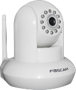
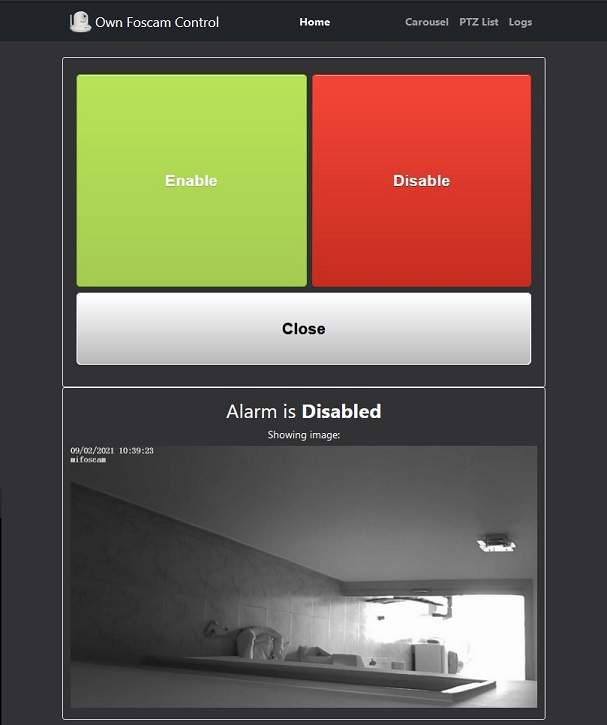

# Own Foscam Control

## About the Project</h2>

A simple app to ease daily and common usage of your Foscam camera, with extra features.

## MongoDB / mySQL for logging

Two branches available. Frontend is 100% shared between mongoDB and mySQL branches.

- MongoDB controllers from [Main](https://github.com/serjmac/own-foscam-control/tree/main) branch.
- mySQL controllers from [mysql](https://github.com/serjmac/own-foscam-control/tree/mysql) branch. You are currently viewing this branch's readme.

## Why?

With the vendor provided Foscam mobile app, operation is slow and sometimes a pain when operating with bad wifi signal. There's lag in operation, image or settings refreshing. Access to snapshots and recordings are done manually searching for content in upload FTP folder. No loging.

## With Own Foscam Control app:

With this app, most common use is available in a frontend. Coded in Javascript and with very light content to load, aplication is fast, responsive and easy to use.

## Additional features available:

- Database (in a MongoDB/mySQL local or cloud host) loging
- Auto generated carousel with snapshots and recordings from FTP monitorized folder.
- Pan Tilt presets direct access for quick goTo reposition

## Installation

npm install

## Usage

node app.js

## Getting Started

**Important:**

The application needs some basic parameters to operate. Everything is setup in a **.env** file, in the root app folder. You may use the provided **.env.demo** file, edit it and remove the .demo extension, filling the needed parameters, values are without quotes, just **KEY=value**:

- SNAP_USR=yourFoscamUser
- SNAP_PWD=yourFoscamPassword
- SNAP_IP=yourFoscamIP
- DB_HOST=MySQLDatabaseHost.test.amazon.com
- DB_PORT=3306
- DB_USER=MySQLDatabaseUser
- DB_PASSWORD=MySQLDatabasePassword
- SNAPSHOT_LIFE_CHECK=30

**More detail:**

### DB_HOST=

This is the host URL to the mySQL database. Tests have been done with a mySQL AWS db.t2.micro instance.

### DB_PORT=

This parameter is optional, if this key is not present in the **.env** file, the app will use the 3306 default port.

### SNAPSHOT_LIFE_CHECK=30

This parameter is the number of days from which FTP snapshots and recordings are discarded, so that their paths will not be stored in the database. Note that files are not deleted from FTP folder, they are just ignored because they are considered too aged.

## Operating

Once parameters are setup, choose the way to start the app:

- node app.js

- nodemon app.js

- forever start app.js (this option is preferred, so that the option to reflush database and restart app will be working from Carousel section with just a button click)

The app will be available on //localhost:3001 by default in this branch.

In Home menu, Enable/Disable buttons set the Motion Detection of the camera. Like this feature, getting pan/tilt preset list or goTo preset, are performed by the CGI request string against the camera. Read the included /docs/ .pdf User Guide for more information.

Double click on the Home menu image opens the image in new tab.

**Close** button will close the window object, leaving the tab empty. That feature is to avoid unexpected resend of the request. This may happen if you leave the browser open in your smartphone, with a tab where the query string contains the /enable or /disable parameter. If browser try to refresh the tab, it may send the command.

Carousel, pan/tilt and logs sections are intuitive:

- Carousel generates slides of the captured images from motion detection triggering. It also create a list of recording links, which are clicable to play.

- PTZ list reads the list of the stored presets and present them in clickable buttons, as goTo buttons.

- Logs generates a table of registries where date/time, IP and userAgent are stored. This is useful if in your family there's more than one that will enable/disable motion detection and you may want to audit who switched off/on the feature at some moment.

## Shortcuts to Enable / Disable Motion detection

As the app accept **/enable** and **/disable** routes in the GET request, it may be intersting to create bookmarks to those URLs to act like app widgets.

## Notes

For Carousel content being avaiable, it is necessary to setup the Foscam FTP and Motion Detection parameters, so that it will upload these files to the /ftp/ app folder. Refer to camera manual.
Still under developtment, more features to be included, aiming to totally exclude the need of camera original app/web component.

From App start, FTP folder is watched. New file detection will launch an event relying on the [Chokidar](https://github.com/paulmillr/chokidar) module. This event is used to store the file path into DB.
On file deletion event, the URL is removed from database.

In the Carousel section, if the app is running on a linux system, the Flush DB button will be available. This triggers a database flush and a **forever restart app.js** script, to resync FTP folder content to database.

Devepment testing on windows and ubuntu systems, targeting a Foscam 9821 unit.

## Release history

- 0.1.1 Minor changes in frontend, added mySQL port branch.
- 0.1 First release

## Troubleshouting

If snapshots are not visible in carousel or recording links are broken, resync Database and check that ftp folder is available and accessible.

App expects this structure to work with:

- videos at: /ftp/record/alarm_YYYYMMDD_hhmmss.mkv
- images at: /ftp/snap/MDAlarm_YYYYMMDD_hhmmss.jpg

Currently the app parses every filename to extract timestamp from YYYYMMDD_hhmmss string. If your camera does not generate this kind of structure, open an issue showing your file structure and I might add alternative such as fs.stat() to take timestamp from attributes and simplify the process.

In mySQL branch, the app looks for "foscam" database on start. If not found, it will try to create the database and the two tables needed to work (ftps and activations tables).

## License

MIT

## Disclaimer

There is no guarantee or responsibility subject to the use of this app.
